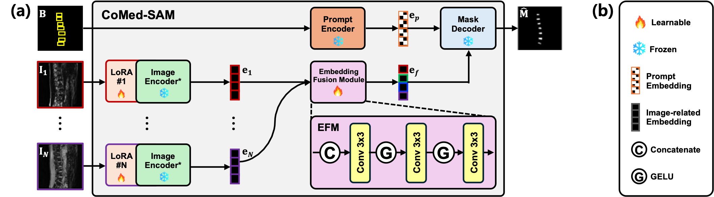

# CoMed-SAM: Collaborative Medical SAM for Multi-Modality Image Segmentation

> Official PyTorch implementation of **CoMed-SAM** (Kim et al., 2025)<br>
> Accepted at [YourConference2025 or Preprint arXiv].

## 🧠 Overview

CoMed-SAM is a collaborative extension of Segment Anything Model (SAM) for multi-modal medical image segmentation. It incorporates:
- Multi-encoder architecture (per modality)
- Modality dropout during training
- Lightweight convolutional fusion
- Prompt-based segmentation inference

## 🖼️ Framework

<p align="center">
  
</p>

## 📁 Dataset Preparation

We used the **IVDM3Seg** dataset for lumbar spine MRI segmentation.

You can download the dataset from the official website:

🔗 [Dataset Download](https://ivdm3seg.weebly.com/data.html)
```bash
CoMed-sam_dataset/
└── IVDM/
    ├── ivdm_npy_train_dataset_1024image/
    │   ├── imgs/
    │   │   ├── 01-01.npy # shape (4, 1024, 1024)
    │   │   ├── 01-02.npy
    │   │   └── ...
    │   └── gts/
    │       ├── 01-01_1.npy # shape (1024, 1024)
    │       ├── 01-01_2.npy
    │       └── ...
    │
    ├── ivdm_npy_val_dataset_1024image/
    │   ├── imgs/
    │   │   ├── 09-01.npy
    │   │   └── ...
    │   └── gts/
    │       ├── 09-01_1.npy
    │       └── ...
    │
    └── ivdm_npy_test_dataset_1024image/
        ├── imgs/
        │   ├── 13-04.npy
        │   └── ...
        └── gts/
            ├── 13-04_1.npy
            ├── 13-04_2.npy
            └── ...

```

## Installation

1. Create a virtual environment  
   ```bash
   conda env create -f environment.yml
   conda activate CoMedSAM

   ```

2. Clone this repository  
   ```bash
   git clone https://github.com/hunzo300/CoMed-SAM.git
   ```

---


## 🛠️ How to Use

### 🔧 1. Training

To train the CoMed-SAM model with dropout-enabled multi-modality input, run:

```bash
python /CoMed-SAM/script/train/train.py
````

This script uses the specified `--tr_npy_path` and `--val_npy_path` and saves checkpoints to `./pth/`.

---

### 📊 2. Quantitative Evaluation on All Phase Combinations

To evaluate segmentation performance across **all phase combinations** (1 to 4 modalities), run:

```bash
bash /CoMed-SAM/script/test/test.sh
```

This executes multiple test scripts like:

```text
/CoMed-SAM/script/test/test_all_combination/test_phase_count_1.py  
/CoMed-SAM/script/test/test_all_combination/test_phase_count_2.py  
/CoMed-SAM/script/test/test_all_combination/test_phase_count_3.py  
/CoMed-SAM/script/test/test_all_combination/test_phase_count_4.py  
```

---

### 🔍 3. Inference on Individual Samples

To perform **inference on individual IVDM samples**, including mask visualization and prediction, use:

```bash
python /CoMed-SAM/script/unit_test/unit_test.py
```

This script loads the trained CoMed-SAM model and runs it on selected test samples.

```


